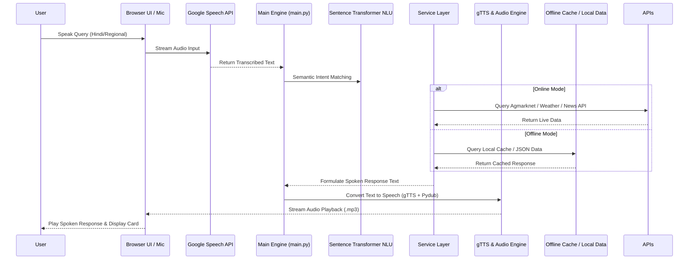
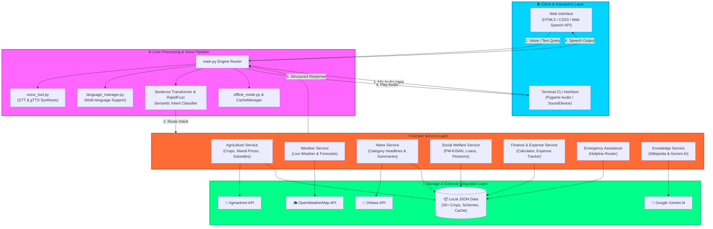
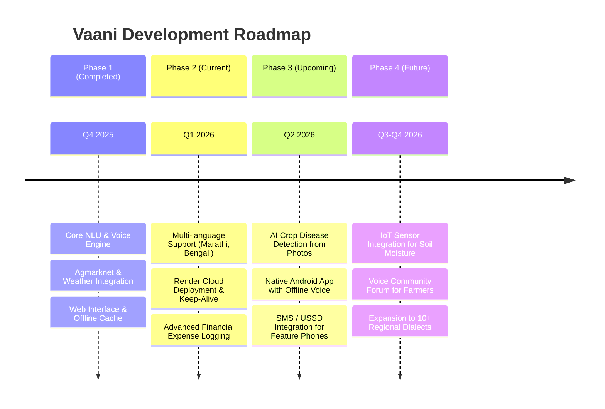

<div align="center">

# 🤖 Vaani (वाणी)


### 🗣️ *Democratizing Digital Access Through Voice – Empowering India's Underserved Populations*

[](https://www.python.org/)
[](https://flask.palletsprojects.com/)
[](https://cloud.google.com/speech-to-text)
[](https://pypi.org/project/gTTS/)
[](https://www.sbert.net/)
[](https://opensource.org/licenses/MIT)
[](https://sdgs.un.org/goals)

---

**Bridging the Digital Divide with Zero Literacy Barriers! 🌾**

[🌐 Deploy on Render](https://render.com/deploy?repo=https://github.com/groupnumber-9/Vaani) • [📖 About](#-about-the-project) • [⚙️ How It Works](#️-how-it-works) • [🏗️ Architecture](#-system-architecture) • [🛠️ Tech Stack](#️-technology-stack) • [🚀 Setup](#-setup--deployment)

</div>

---

## 📖 About the Project

**Vaani (वाणी)** is India's first voice-first digital inclusion platform designed specifically for **300+ million functionally illiterate and semi-literate citizens**. By removing text literacy as a pre-requisite for digital services, Vaani enables anyone who can speak to seamlessly access essential government schemes, agricultural advice, market commodity prices, weather forecasts, financial services, news, and emergency assistance.

While agriculture served as our entry point, Vaani empowers all underserved populations: **farmers (146M), elderly citizens (104M), disabled persons (27M), domestic workers (50M), daily wage workers (139M), women in conservative families (80M), and migrant workers (139M)** who are otherwise excluded from India's digital revolution.

> [!NOTE]  
> **🎯 Mission:** To democratize digital access across India by ensuring that literacy is never a barrier to accessing critical information, fundamental rights, financial tools, and life-saving emergency services.

---

## 🚨 The Problem

<div align="center">

```ascii
╔══════════════════════════════════════════════════════════════╗
║        ⚠️  CHALLENGES IN RURAL & LITERACY-BARRED ACCESS     ║
╠══════════════════════════════════════════════════════════════╣
║                                                              ║
║  📄  Text-heavy mobile apps & websites bar 300M+ citizens   ║
║  🌾  Farmers lack real-time market prices & crop disease info║
║  🏛️  Government welfare schemes remain unused & inaccessible  ║
║  🌦️  Unpredictable weather losses without localized alerts   ║
║  📱  Complex touch UI navigation confuses elderly & disabled  ║
║  🌐  Poor internet connectivity in remote rural pockets      ║
║                                                              ║
╚══════════════════════════════════════════════════════════════╝
```

</div>

Traditional mobile applications and digital government portals rely heavily on text literacy, complex menu navigation, and constant high-speed internet connection. This creates a severe digital divide, leaving over 695 million rural and semi-literate Indians without access to vital economic and social resources.

---

## ✅ Our Solution

**Vaani** transforms digital interaction into an intuitive, voice-first experience powered by semantic NLU and local caching:

<table>
<tr>
<td width="50%">

### 🎯 Core Capabilities
- 🗣️ **Conversational Voice Interface in Natural Hindi**
- 🌾 **Live Agmarknet Market Prices & Crop Advisories**
- 📋 **Automated Government Scheme Eligibility Checker**
- 🌦️ **Location-Aware Weather Forecasts & Warnings**

</td>
<td width="50%">

### 🚀 Key Benefits
- ⚡ **Zero Literacy Barrier (Spoken Voice In & Out)**
- 🌐 **Offline Mode for Low Connectivity Areas**
- 💰 **Built-in Expense Tracker & Calculator**
- 🚨 **One-Touch Voice Emergency Helpline Router**

</td>
</tr>
</table>

---

## ⚙️ How It Works

<div align="center">



</div>

### 🔄 Step-by-Step User Journey

<table>
<tr>
<td width="33%" align="center">

### 1️⃣ Speak Command
<br/>

[](https://cloud.google.com/speech-to-text)

<br/>

Click microphone or speak naturally in Hindi / regional dialect

</td>
<td width="33%" align="center">

### 2️⃣ Intent Recognition
<br/>

[](https://www.sbert.net/)

<br/>

Sentence Transformers map colloquial speech to underlying actions

</td>
<td width="33%" align="center">

### 3️⃣ Live API / Cache Retrieval
<br/>

[](https://data.gov.in)

<br/>

Fetches Agmarknet prices, OpenWeather reports, or cached JSON

</td>
</tr>
<tr>
<td width="33%" align="center">

### 4️⃣ Context Management
<br/>

[](https://www.python.org/)

<br/>

Remembers conversation history for seamless multi-turn follow-ups

</td>
<td width="33%" align="center">

### 5️⃣ Voice Synthesis
<br/>

[](https://pypi.org/project/gTTS/)

<br/>

Generates natural speech with volume normalization & speed tuning

</td>
<td width="33%" align="center">

### 6️⃣ Audio Response
<br/>

[](https://www.pygame.org/)

<br/>

Plays audio response clearly while rendering summary cards on screen

</td>
</tr>
</table>

---

## 🏗️ System Architecture



---

## 🛠️ Technology Stack

<div align="center">

### 🗣️ Speech, Audio & NLU


**Advanced STT, gTTS voice synthesis, Pydub volume/speed enhancement, Pygame playback, and semantic intent matching**

### 🌐 Backend Server & Web Framework


**Flask web engine serving REST endpoints, Web Speech mic integration, and responsive cards**

### 🔌 APIs & External Integrations


**Integrated government & commercial REST APIs for real-time weather, market rates, news, and knowledge queries**

### 📦 Storage & Deployment


**Offline-first local JSON caching architecture deployable on Render cloud or Docker containers**

</div>

---

## 📂 Project Structure

```
Vaani/
│
├── 📁 vaani/                       # Core Package Source Code
│   ├── 📁 core/                    # System Core & Engine Modules
│   │   ├── 🚀 main.py              # Application entry point & command router loop
│   │   ├── 🔊 voice_tool.py        # SpeechRecognition (STT) & gTTS audio pipeline
│   │   ├── 🧠 context_manager.py   # State management (NewsContext, AgriContext, SchemeContext)
│   │   ├── 🌐 language_manager.py  # Multi-language translation & TTS code resolver
│   │   ├── ⚙️ config.py            # Central triggers (30+ lists), phrases & API keys
│   │   ├── 💾 offline_mode.py      # Offline connectivity checker & local fallback router
│   │   ├── ⚡ cache_manager.py      # Cache invalidation & storage controller
│   │   └── 🔒 api_key_manager.py  # Secure API key encryption & loader
│   │
│   ├── 📁 services/                # Modular Domain Service Layer
│   │   ├── 🌾 agriculture/         # Crop advisories (30+ crops) & Agmarknet market rates
│   │   ├── 🌦️ weather/             # OpenWeatherMap API wrapper & rain advisories
│   │   ├── 📰 news/                # GNews API integration & headline summarizer
│   │   ├── 📋 social/              # Government schemes (PM-KISAN, Ayushman Bharat) & emergency
│   │   ├── 💸 finance/             # Expense tracker, daily calculator & financial literacy
│   │   ├── 🧠 knowledge/           # Wikipedia API & Google Gemini AI fallback
│   │   ├── 📱 communication/       # SMS / USSD messaging integration
│   │   └── 🕒 time/                # Current date, time & history facts
│   │
│   ├── 📁 utils/                   # Shared Helper Utilities
│   └── 🌐 web.py                   # Flask server entry point & web API routes
│
├── 📁 data/                        # Static Data Models & Offline Cache
│   ├── 🌾 crop_data/               # JSON datasets for 30+ crops
│   ├── 📋 scheme_data/             # Government scheme eligibility guidelines
│   ├── 💳 loan_data/               # Microfinance & KCC loan details
│   ├── 💸 subsidy_data/            # Agricultural subsidies documentation
│   └── 💾 offline_cache/           # Cached news, weather, and market responses
│
├── 📁 docs/                        # Project Documentation
│   ├── 🏗️ PROJECT_ARCHITECTURE.md  # Detailed system architecture & flow diagrams
│   ├── 📖 USER_MANUAL.md           # End-user voice command guide
│   ├── 🐛 DEBUGGING_GUIDE.md       # Error tracking & troubleshooting procedures
│   └── 🚀 RENDER_DEPLOYMENT_GUIDE.md# Cloud deployment step-by-step instructions
│
├── 📁 tests/                       # Automated Test Suite (Unittest)
├── ⚡ start_web.ps1                 # Windows web interface launcher script
├── ⚡ start_vaani.ps1               # Windows CLI launcher script
├── 🐳 Dockerfile                   # Docker container build specification
├── ⚙️ render.yaml                  # Render cloud deployment specification
├── 📄 requirements.txt             # Python dependencies specification
├── 📄 setup.py                     # Package installation configuration
├── 📖 README.md                    # Main Project Documentation
└── 📄 LICENSE                      # MIT Open Source License
```

---

## 🗣️ Voice Commands & Service Reference

<div align="center">

| Service | Example Hindi Voice Command | Functionality | Data Source / API |
|:---:|:---|:---|:---|
| 🌾 **Crop Advisory** | `"धान की खेती के बारे में बताओ"` | Comprehensive farming guide, soil & sowing tips | Local JSON (30+ crops) |
| 💰 **Market Prices** | `"आज गेहूं का रेट क्या है"` | Real-time commodity market prices | Agmarknet API |
| 📋 **Govt Schemes** | `"PM Kisan योजना के बारे में बताओ"` | Scheme details, eligibility & application steps | Scheme JSON Datasets |
| 🌦️ **Weather Report** | `"दिल्ली का मौसम कैसा है"` | Temperature, humidity, rain forecast & advice | OpenWeatherMap API |
| 📰 **Voice News** | `"आज की ताज़ा खबरें सुनाओ"` | Top headlines with interactive details | GNews API & Cache |
| 🧮 **Calculator** | `"500 में से 200 घटाओ"` | Hands-free spoken arithmetic calculations | Internal Math Engine |
| 💸 **Expense Tracker**| `"खर्चा जोड़ो 500 रुपये बीज"` | Log expense items and query monthly spend totals | Local Storage / JSON |
| 🚨 **Emergency** | `"एम्बुलेंस नंबर बताओ"` | Immediate helpline routing (100, 102, 1091) | Emergency Directory |
| 🧠 **General Knowledge**| `"भारत की राजधानी क्या है"` | Answer curiosity questions & general facts | Google Gemini AI / Wikipedia |

</div>

---

## 🚀 Setup & Deployment Guide

### Prerequisites

* **Python 3.8+** (Python 3.10+ recommended)
* **Microphone & Speaker** connected to your device
* **FFmpeg** installed (for audio enhancement with Pydub)
* Modern web browser (Google Chrome or Microsoft Edge recommended)

---

### 1️⃣ Clone the Repository

```bash
git clone https://github.com/ankittroy-21/Vaani.git
cd Vaani
```

---

### 2️⃣ Install Dependencies & FFmpeg

**Install Python packages:**
```bash
pip install -r requirements.txt
```

**Install FFmpeg:**
* **Windows (PowerShell):**
  ```powershell
  .\scripts\install_ffmpeg.ps1
  ```
* **Linux (Ubuntu/Debian):**
  ```bash
  sudo apt-get update && sudo apt-get install -y ffmpeg
  ```
* **macOS:**
  ```bash
  brew install ffmpeg
  ```

---

### 3️⃣ Configure API Keys

Create a `.env` file in the root directory:

```env
WEATHER_API_KEY=your_openweathermap_key
GNEWS_API_KEY=your_gnews_key
AGMARKNET_API_KEY=your_agmarknet_key
GEMINI_API_KEY=your_google_gemini_key
```

> **Free API Keys:**
> * OpenWeatherMap: [openweathermap.org](https://openweathermap.org/appid)
> * GNews: [gnews.io](https://gnews.io/)
> * Agmarknet: [data.gov.in](https://data.gov.in)

---

### 4️⃣ Run Vaani Locally

#### Option A: Web Interface (Recommended) 🌐

**Windows (PowerShell Quick Start):**
```powershell
.\start_web.ps1
```

**Manual Start (Any OS):**
```bash
python -m vaani.web
```
Open your browser at **`http://localhost:5000`** 🎉

#### Option B: Terminal CLI Mode 💻

```bash
python -m vaani.core.main
```

---

### 5️⃣ Deploy to Cloud (Render / Docker)

[](https://render.com/deploy?repo=https://github.com/groupnumber-9/Vaani)

**Deploy with Docker:**
```bash
docker build -t vaani-app .
docker run -p 5000:5000 vaani-app
```

---

## 🔮 Future Enhancements & Roadmap

<div align="center">



</div>

### 🎯 Planned Features Checklist

- [x] Natural Hindi Voice STT & gTTS Audio Pipeline
- [x] Agmarknet Live Mandi Prices & 30+ Crop Datasets
- [x] Offline Mode Cache for Essential Schemes & News
- [ ] 📱 **Native Android Application** - Offline voice processing on low-cost smartphones
- [ ] 🤖 **AI Crop Disease Scanner** - Instant leaf diagnosis using computer vision
- [ ] 📲 **USSD & Interactive Voice Response (IVR)** - Access via basic feature phones without internet
- [ ] 🗣️ **Extended Regional Language Support** - Full support for Punjabi, Gujarati, Telugu, and Kannada

---

## 💡 Key Concepts & Use Cases

<table>
<tr>
<td width="50%">

### 🌾 For Farmers & Rural Citizens
- ✅ Speak naturally in Hindi to check crop market prices before selling
- ✅ Learn step-by-step disease control methods for 30+ crops
- ✅ Check eligibility for PM-KISAN, crop insurance, and solar pumps
- ✅ Get urgent weather advisories to plan harvesting & spraying

</td>
<td width="50%">

### 🎓 For Developers & Civic Tech Researchers
- ✅ Reference implementation of low-literacy voice interface design
- ✅ Offline-first architecture combining live APIs with local JSON cache
- ✅ Hybrid NLU combining Sentence Transformers with fuzzy matching
- ✅ Aligned with UN Sustainable Development Goals (SDG 1 & SDG 8)

</td>
</tr>
</table>

---

## 👥 Contributors

<div align="center">

<table>
  <tr>
    <td align="center">
      <a href="https://github.com/tech4commun">
        <br />
        <sub><b>Arpit Verma</b></sub>
      </a><br />
      <a href="https://github.com/tech4commun">GitHub</a> •
      <a href="https://www.linkedin.com/in/arpit-verma-98010129a/">LinkedIn</a>
    </td>
    <td align="center">
      <a href="https://github.com/ankittroy-21">
        <br />
        <sub><b>Ankit Roy</b></sub>
      </a><br />
      <a href="https://github.com/ankittroy-21">GitHub</a> •
      <a href="https://www.linkedin.com/in/ankittroy-21">LinkedIn</a>
    </td>
    <td align="center">
      <a href="https://github.com/anurag-joshi-1403">
        <br />
        <sub><b>Anurag Joshi</b></sub>
      </a><br />
      <a href="https://github.com/anurag-joshi-1403">GitHub</a> •
      <a href="https://www.linkedin.com/in/anurag-joshi-1403">LinkedIn</a>
    </td>
  </tr>
</table>

**College Minor Project | UN SDG Aligned (No Poverty & Decent Work)**

</div>

---

## 📄 License & Support

<div align="center">

This project is open-source under the **MIT License** — see the [LICENSE](LICENSE) file for details.

### 🌟 Show Your Support

If you find **Vaani** impactful or inspiring, please consider leaving a ⭐ on GitHub!

[](https://github.com/ankittroy-21/Vaani/stargazers)
[](https://github.com/ankittroy-21/Vaani/network/members)
[](https://github.com/ankittroy-21/Vaani/issues)

---

### 💬 Vaani: If You Can Speak, You Deserve Equal Access to Information & Opportunities!

**© 2026 Vaani Team | Built with ❤️ for Digital Inclusion**

</div>
